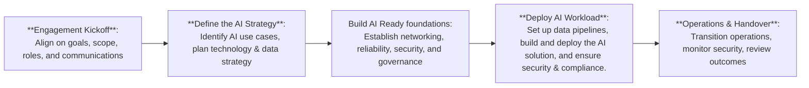

# Simplified RACI Model for AI on Azure

## Introduction
This RACI chart outlines the key roles and responsibilities for implementing AI solutions on Azure.  
**Note:** This model is designed for delivery by a Microsoft Partner to a customer organization, ensuring clear accountability and collaboration throughout the engagement.

RACI stands for:
- **R**esponsible: Performs the work
- **A**ccountable: Ultimately answerable for the work
- **C**onsulted: Provides input before decisions/actions
- **I**nformed: Notified of decisions/actions

## Business Strategy

| Activity | Customer Business | Customer IT Leadership | Customer Data Team | Customer Security & Compliance | Microsoft Partner |
|----------|:----------------:|:---------------------:|:-----------------:|:------------------------------:|:----------------:|
| Identify AI Use Cases | A/R | C | R | I | C |
| Define AI Technology Strategy | A | R | C | C | C/R |
| Define AI Data Strategy | A | C | R | C | C/R |
| Define Responsible AI Strategy | A | C | C | R | C |

## Azure Landing Zone Implementation

| Activity | Customer Business | Customer IT Leadership | Customer Data Team | Customer Security & Compliance | Microsoft Partner |
|----------|:----------------:|:---------------------:|:-----------------:|:------------------------------:|:----------------:|
| Conceptual Azure Landing Zone | I | A/R | C | C | R |
| Application Landing Zones | I | A/R | C | C | R |
| Data Management Landing Zone | I | A | R | C | R |
| Data Landing Zones | I | A | R | C | R |
| AI Landing Zone | I | A | R | C | R |

## AI Solution Development & Operations

| Activity | Customer Business | Customer IT Leadership | Customer Data Team | Customer Security & Compliance | Microsoft Partner |
|----------|:----------------:|:---------------------:|:-----------------:|:------------------------------:|:----------------:|
| Data Ingestion & Preparation | I | C | A/R | C | R |
| Model Development | I | I | A/R | C | R |
| Model Deployment | I | C | A/R | C | R |
| Security & Compliance | I | C | C | A/R | C |
| Cost Management | A | R | C | I | C |
| Ongoing Operations | I | A/R | C | C | C |

## Legend:
- **Customer Business**: Business leadership, stakeholders, product owners from the customer organization
- **Customer IT Leadership**: Enterprise architects, IT management, cloud platform teams from the customer
- **Customer Data Team**: Data scientists, ML engineers, data engineers from the customer
- **Customer Security & Compliance**: Security teams, compliance officers, governance specialists from the customer
- **Microsoft Partner**: Microsoft Partner delivery team (consultants, architects, engineers)

---

## Orchestration Guide: How Teams Collaborate (Microsoft Partner Delivery)

This guide outlines how the Microsoft Partner and customer teams work together throughout the AI on Azure engagement.

### 1. Engagement Kickoff
- **Microsoft Partner** facilitates a kickoff meeting to align on objectives, scope, and roles.
- **Customer Business** defines business goals and success criteria.
- **All teams** agree on communication channels and cadence.

### 2. Strategy & Planning
- **Customer Business** leads identification of AI use cases, with input from the **Partner** and **Customer Data Team**.
- **Microsoft Partner** drafts technology and data strategies, consulting **Customer IT Leadership** and **Security & Compliance**.
- **Customer Security & Compliance** reviews strategies for regulatory alignment.

### 3. Landing Zone Design & Deployment
- **Microsoft Partner** leads design and deployment of Azure landing zones.
- **Customer IT Leadership** is accountable for integration with existing environments.
- **Customer Data Team** and **Security & Compliance** are consulted to ensure requirements are met.

### 4. Solution Development
- **Microsoft Partner** is responsible for technical implementation (data pipelines, model development, deployment).
- **Customer Data Team** collaborates on data preparation and model validation.
- **Customer Security & Compliance** reviews for compliance and security.
- **Customer Business** is kept informed and provides feedback.

### 5. Operations & Handover
- **Microsoft Partner** supports initial operations and knowledge transfer.
- **Customer IT Leadership** and **Data Team** take over ongoing operations.
- **Customer Security & Compliance** continues monitoring.
- **Customer Business** reviews outcomes and drives continuous improvement.

### 6. Communication & Governance
- Regular joint standups and steering meetings.
- Shared documentation and decision logs.
- Clear escalation paths for issues.

> **Best Practice:** Use a project management tool for transparent task tracking, documentation, and communication.

