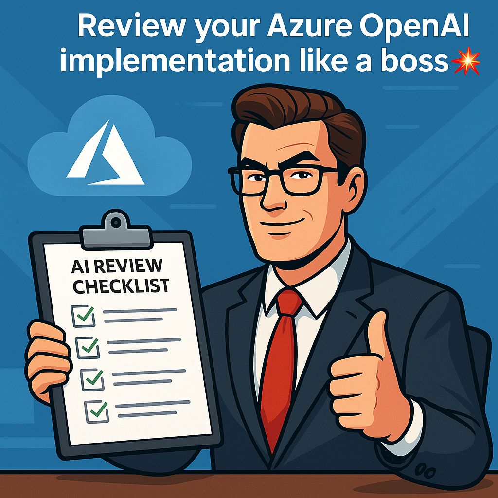

# AI Landing Zone Checklist Summaries

This repository provides categorized markdown summaries of best practices and recommendations for deploying and managing Azure OpenAI workloads. The content is based on Microsoft's official [Azure OpenAI Best Practices Quick Reference Guide](https://techcommunity.microsoft.com/blog/startupsatmicrosoftblog/azure-openai-best-practices-a-quick-reference-guide-to-optimize-your-deployments/4403546) and the comprehensive AI Landing Zone checklist.

## About the Markdown Files
Each file in this folder corresponds to a key area of Azure OpenAI deployment:

- 🚀 [**Application Deployment**](./application_deployment.md): Recommendations for application deployment, including DevOps and data classification.
- 🌐 [**BCDR**](./bc_and_dr.md): Business Continuity and Disaster Recovery (BCDR) strategies, such as multi-region deployments and failover.
- 💸 [**Cost Governance**](./cost_governance.md): Cost management, optimization, quota management, and usage monitoring.
- 🛡️ [**Governance & Security**](./governance_and_security.md): Security baselines, access controls, compliance, and governance strategies.
- 👤 [**Identity & Access Management**](./identity_and_access_management.md): Identity, authentication, and RBAC best practices.
- 🕸️ [**Network Topology & Connectivity**](./network_topology_and_connectivity.md): Networking, VNet isolation, private endpoints, and secure connectivity.
- ⚙️ [**Operations**](./operations.md): Monitoring, logging, alerting, and operational excellence.
- 📋 [**Best Practices Summary**](./best-practices-summary.md): A consolidated summary of all key Azure OpenAI best practices.

Each markdown file contains a table with:
- **Category** and **Subcategory**
- **Recommendation**: Actionable best practice
- **Service**: Relevant Azure service
- **Priority**: (High/Medium/Low)
- **Reference**: Direct link to Microsoft documentation

## Key Best Practice Themes
- **Architecture**: Design for scalability, reliability, and cost-efficiency using Azure's Well-Architected Framework.
- **Security**: Encrypt data at rest and in transit, use RBAC, and follow the Azure Security Baseline for OpenAI.
- **Governance**: Apply resource tagging, enforce policies with Azure Policy, and ensure compliance with regulatory requirements.
- **Networking**: Use VNets and private endpoints to isolate and secure AI resources.
- **Monitoring**: Enable diagnostic logs, set up alerts, and use Azure Monitor for proactive health and performance management.
- **Quota Management**: Monitor usage, request quota increases proactively, and leverage Provisioned Throughput Units (PTUs) for predictable performance.
- **BCDR**: Deploy multi-region gateways (e.g., APIM + Azure Front Door) for high availability and disaster recovery.

## How to Use
These summaries help:
- Validate your Azure OpenAI architecture
- Uncover gaps in security, governance, or operations
- Guide implementation and review discussions
- Quickly access authoritative Microsoft documentation

For the full checklist and more details, see the [Azure OpenAI Best Practices Quick Reference Guide](https://techcommunity.microsoft.com/blog/startupsatmicrosoftblog/azure-openai-best-practices-a-quick-reference-guide-to-optimize-your-deployments/4403546).

---

*This repository is not an official Microsoft product but is based on public Microsoft best practices and documentation as of April 2025.*
